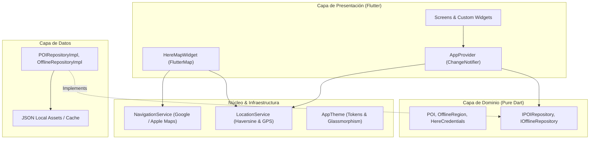

# 🗺️ Turismo Local — Interactive Smart Tourism & Open Mapping

[](https://flutter.dev)
[](https://dart.dev)
[](https://blog.cleancoder.com/uncle-bob/2012/08/13/the-clean-architecture.html)
[](https://docs.fleaflet.dev/)
[](https://pub.dev/packages/provider)
[](LICENSE)

**Turismo Local** es una aplicación móvil avanzada de **turismo inteligente, cartografía interactiva y audioguías culturales** desarrollada en **Flutter**. Diseñada bajo estándares de ingeniería de software para proyectos de producción, implementa **Clean Architecture**, **servicios de cartografía abierta sin costes de licencia**, un **motor GIS multi-capa simultáneo**, **geolocalización en tiempo real con mitigación de latencia de fix GPS**, y **navegación asistida paso a paso hacia puntos de interés**.

---

## 🌟 Características Principales

### 1. 🗺️ Motor Cartográfico Libre & Multi-Capa
* **Zero Cost & Open Source**: Sustitución de APIs de pago por un ecosistema de teselas cartográficas abiertas y escalables (`flutter_map` v7 + `latlong2`).
* **Estilos Base Intercambiables**:
  * 🌙 **CartoDB Dark Matter**: Mapa oscuro de alto contraste y estética moderna.
  * 🗺️ **OpenStreetMap Estándar**: Cartografía urbana detallada con nomenclátor completo.
  * 🏔️ **OpenTopoMap**: Relieve topográfico con curvas de nivel y elevación.
  * 🛰️ **Esri World Imagery**: Fotografía satelital de alta resolución global.
* **Superposición Multi-Capa Simultánea**: Permite activar y combinar múltiples capas a la vez mediante switches:
  * 🚴 **Capa de Rutas Ciclistas** (*Waymarked Trails Cycling*).
  * 🥾 **Capa de Senderismo y Montaña** (*Waymarked Trails Hiking*).
  * 🏛️ **Marcadores Interactivos de POIs** con globos dinámicos.
  * 🛣️ **Polyline de Ruta de Navegación** con halo de luz resplandeciente.

### 2. 📍 Geolocalización Inteligente & Auto-Centrado
* **Arranque Instantáneo sin Latencia**: Consulta primero la última posición conocida (`Geolocator.getLastKnownPosition()`) para situar el mapa de inmediato en la ciudad real del usuario sin esperar el bloqueo de satélites GPS.
* **Auto-Centrado Reactivo**: Transición animada automática al recibir la primera posición GPS precisa.
* **Botón Flotante "Centrar en mi ubicación"**: Re-centra la cámara con zoom `15.5` en tiempo real y gestiona permisos de forma transparente.

### 3. 🧭 Navegación Asistida al Destino Seleccionado
* **Trazado de Trayectoria en Mapa**: Polyline animada que conecta la posición del usuario con el monumento o punto turístico seleccionado.
* **Banner de Navegación Flotante**:
  * Cálculo de distancia exacta mediante la fórmula matemática de **Haversine**.
  * Estimación de tiempo a pie (ej. `🚶 12 min a pie`).
  * **Navegación GPS Real**: Integración con `url_launcher` para abrir la ruta en **Google Maps** o **Apple Maps** con un solo toque.
  * Acceso directo a la ficha detallada del monumento.

### 4. 📦 Modo Offline & Descarga de Regiones
* Gestor interactivo para simular y descargar paquetes regionales de cartografía y datos turísticos para exploración sin cobertura móvil.
* Ciudades y regiones incluidas con datos reales: **Madrid**, **Barcelona**, **Sevilla**, **Zaragoza**, **Valencia** y **Granada**.

### 5. 🎧 Audioguías & Contenido Cultural
* Fichas detalladas con fotografías en alta resolución, reseñas de visitantes, duración estimada de audioguía narrada en HD, dirección y coordenadas GPS formateadas.
* Filtro por categorías temáticas: *Monumentos*, *Gastronomía*, *Naturaleza* y *Cultura*.
* Barra de búsqueda reactiva por nombre, descripción o etiquetas.

---

## 📐 Arquitectura & Patrones de Diseño

El proyecto implementa **Clean Architecture** para garantizar un desacoplamiento total entre la lógica de negocio, las fuentes de datos y los componentes visuales:



---

## 📂 Estructura del Código Fuente

```
lib/
├── core/
│   ├── config/             # Configuración general y constantes de entorno
│   ├── services/
│   │   ├── location_service.dart     # GPS, permisos, stream y cálculo Haversine
│   │   ├── navigation_service.dart   # Deep linking a Google Maps / Apple Maps
│   │   └── here_sdk_service.dart     # Servicio de inicialización y formateo
│   └── theme/
│       └── app_theme.dart            # Paleta de colores, sombras y tokens glassmorphism
├── domain/
│   ├── models/             # PlaceOfInterest, OfflineRegion, HereCredentials
│   └── repositories/       # Interfaces puras (IPOIRepository, IOfflineRepository)
├── data/
│   ├── datasources/        # Fuentes de datos JSON para monumentos y regiones
│   └── repositories_impl/  # Implementaciones de repositorios con carga asíncrona
├── presentation/
│   ├── providers/          # AppProvider (estado global del mapa y filtros)
│   ├── screens/
│   │   ├── map_screen.dart           # Pantalla principal del mapa interactivo
│   │   ├── poi_detail_screen.dart    # Detalle con audioguía y navegación directa
│   │   ├── offline_maps_screen.dart  # Gestor de descarga de regiones
│   │   └── settings_screen.dart      # Ajustes de capas y credenciales
│   └── widgets/
│       ├── here_map_widget.dart      # Widget principal con FlutterMap y selector multi-capa
│       ├── poi_card.dart             # Tarjeta del carrusel horizontal inferior
│       ├── category_chips.dart       # Chips de filtrado rápido por categoría
│       └── proximity_banner.dart     # Banner de alerta por cercanía a monumentos
├── l10n/                   # Internacionalización (app_es.arb, app_en.arb)
└── main.dart               # Punto de entrada de la aplicación
```

---

## 🚀 Instalación y Puesta en Marcha

### Prerrequisitos
* **Flutter SDK**: `>=3.13.3` ([Instrucciones de instalación](https://docs.flutter.dev/get-started/install))
* **Dart SDK**: `>=3.0.0`
* Dispositivo físico o emulador (Android, iOS o macOS Desktop)

### 1. Clonar el repositorio
```bash
git clone https://github.com/alfredoespal97/turismo-local.git
cd turismo-local
```

### 2. Descargar dependencias
```bash
flutter pub get
```

### 3. Ejecutar en emulador o dispositivo
```bash
# Android / iOS / macOS
flutter run
```

---

## 🧪 Pruebas Unitarias y Calidad de Código

El proyecto cuenta con un conjunto de pruebas automatizadas y cumple con los estándares más estrictos de análisis estático del SDK de Flutter:

```bash
# Ejecutar análisis estático (0 warnings / 0 issues)
flutter analyze

# Ejecutar suite de pruebas unitarias
flutter test
```

Resultados de la verificación:
```text
Analyzing turismo_local_here...
No issues found!

00:00 +6: All tests passed!
```

---

## 💼 Aspectos Técnicos Destacados para Entrevistas / CV

* **Dominio de Sistemas GIS y Cartografía Móvil**: *Implementación de renderizado de teselas raster y vectoriales con cacheado eficiente, mitigación de artefactos visuales y soporte de múltiples proyecciones y capas superpuestas.*
* **Arquitectura Limpia & Escalabilidad**: *Separación en capas desacopladas (Clean Architecture) que permite reemplazar proveedores de mapas (OSM, Mapbox, HERE, Google Maps) sin tocar la lógica de negocio ni la interfaz de usuario.*
* **Eficiencia Energética y Experiencia de Usuario**: *Uso de `getLastKnownPosition()` para inicio inmediato y streams con filtros de distancia (`distanceFilter: 20m`) para evitar el drenaje excesivo de batería en el seguimiento GPS.*
* **Navegación Cross-Platform**: *Deep linking seguro y fallback automático hacia Google Maps y Apple Maps según la plataforma de destino.*

---

## 📄 Licencia

Este proyecto está bajo la Licencia **MIT**. Consulta el archivo [LICENSE](LICENSE) para más información.